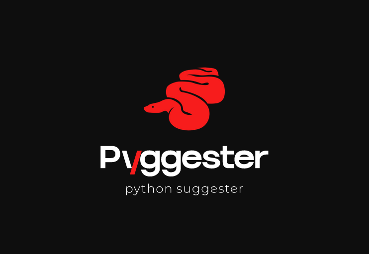
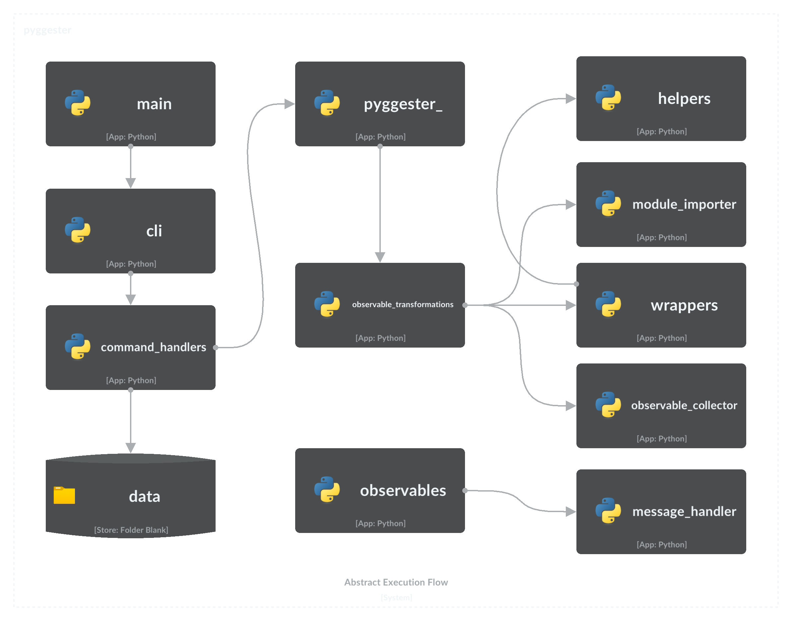

<!-- # nettxio_cli -->
<!-- <p align="center"> -->
  <!--  -->
<!-- </p> -->

<p align="center">
    
</p>

<h1 align="center">Pyggester - dynamic/static python analysis</h1>


# 📘 About

pyggester - (python + suggester) functions as both a dynamic and static analyzer. Its primary purpose lies in offering suggestions to enhance the efficiency of Python code by addressing suboptimal usage of data structures.

# ⭐ Features

  Pyggester offers a pretty decent cli interface for its functionalities. The cli is built on top of [typer](https://github.com/tiangolo/typer)
  
  `Execution command`:
  ```bash
  pyggest
  ```
  `output`:
  ```
                                            _____
_____________  ________ _______ ______________  /_____________
___  __ \_  / / /_  __ `/_  __ `/  _ \_  ___/  __/  _ \_  ___/
__  /_/ /  /_/ /_  /_/ /_  /_/ //  __/(__  )/ /_ /  __/  /
_  .___/_\__, / _\__, / _\__, / \___//____/ \__/ \___//_/
/_/     /____/  /____/  /____/


 Usage: pyggest [OPTIONS] COMMAND [ARGS]...

╭─ Options ────────────────────────────────────────────────────────────────────────────────────────────────────────────────────────────────────╮
│ --install-completion          Install completion for the current shell.                                                                      │
│ --show-completion             Show completion for the current shell, to copy it or customize the installation.                               │
│ --help                        Show this message and exit.                                                                                    │
╰──────────────────────────────────────────────────────────────────────────────────────────────────────────────────────────────────────────────╯
╭─ Commands ───────────────────────────────────────────────────────────────────────────────────────────────────────────────────────────────────╮
│ static                 Perform static analysis using PyggestStatic.                                                                          │
│ transform              Perform dynamic transformation using PyggesterDynamic.                                                                │
╰──────────────────────────────────────────────────────────────────────────────────────────────────────────────────────────────────────────────╯
  ```

   The pyggester CLI presents two distinct features:
  - Static Analysis: This feature comprehensively examines your code without executing it, providing insightful insights into its structure and potential improvements.
    
    `Execution command`

    > [!NOTE]
    > The 'static' subcommand exists, but has no functionalities implemented, because we already have good static analyzers(pylint, ruff, flake8). In future iterations, should we identify suggestions that can be established through static analysis, we will incorporate them into this feature.

    ```bash
    pyggest static
    ```

  - Dynamic/Automatic Transformation: This feature adds extra code to your python files to analyze your data structures at runtime. Your original code stays the same; it won't be changed. A new file is created that's just like the original but with additional code. This works for both single files and whole directories(full project structures).

    `Execution command`

    ``` bash
    pyggest transform
    ```

> [!INFO]
> pyggester offers built-in documentation for detailed usage

```bash
pyggest transform --help 
pyggest static --help #NOT IMPLEMENTED
```


# 🔧 Installation

  ### Using Pip
  You can easily install the Python library using pip. Open your terminal and run the following command:
  ```bash
  pip install pyggester
  ```


  ### Cloning the GitHub Repository

  1. **Clone the Repository:** Open your terminal and run the following command to clone the GitHub repository to your local machine:

      ```bash
      git clone git@github.com:ValdonVitija/pyggester.git
      ```
  2. **Navigate to the Repository:** Change your working directory to the cloned repository:

      ```bash
      cd pyggester
      ```
  3. **Install pyggester as a pacakge locally:** 
        > [!IMPORTANT]
        > Consider doing this within a virtual environment (venv) if possible.
    
        ```bash
        pip install .
        ```

# Usage (Step-by-Step)

## Single File Usage


Lets suppose you have a single python file that you want to dynamically analyze(run-time analysis)

### 1. Preparation

Before code transformation with pyggester:
```bash
(venv) root@user:~/my_app> ls
app.py
```

Content of app.py:

```python
def sum_of_integers(integer_list):
    total = sum(integer_list)
    return total

my_list = [1, 2, 3, 4, 5]
print(sum_of_integers(my_list))

```
### 2. Transformation

> [!IMPORTANT]
> **Make sure you're in a virtual environment with pyggester installed before going to the next step.**

```bash
(venv) root@devs04:~/my_app> pyggest transform app.py
╭──────────────────────────────────────────────────────────────────────────────────────────────────────────────────────────────────────────────╮
│ File transformed successfully!                                                                                                               │
╰──────────────────────────────────────────────────────────────────────────────────────────────────────────────────────────────────────────────╯
```
### 3. Post-Transformation

```bash
(venv) root@devs04:~/my_app> ls
app.py  app_transformed.py
```

Content of app_transformed.py:

```python
from pyggester.observable_collector import OBSERVABLE_COLLECTOR
from pyggester.observables import ObservableNumpyArray, ObservableNamedTuple, ObservableSet, ObservablePandasDataFrame, ObservableList, ObservableDict, ObservableTuple


def sum_of_integers(integer_list):
    total = sum(integer_list)
    return total


my_list = ObservableList([1, 2, 3, 4, 5])
OBSERVABLE_COLLECTOR.append(my_list)
print(sum_of_integers(my_list))

for observable in OBSERVABLE_COLLECTOR:
    observable.run()

```

> [!IMPORTANT]
> We now have a new file, automatically created, that mirrors the original file. This new file includes all the contents of the original, plus extra code for analyzing your code during runtime. Instead of running the original 'app.py', you should now run 'app_transformed.py'. Rest assured, everything from 'app.py' is retained in 'app_transformed.py'.

### 4. Running the Transformed Code

```bash
(venv) root@devs04:~/my_app> python3 app_transformed.py
15
╭────────────────────────────────────────────────────────────────────────────╮
│ 10 | Suggestions(/root/my_app/app_transformed.py):                         │
│     [*] Consider using an array.array instead of a list, for optimal       │
│ memory consumption                                                         │
│     [*] Consider using a set instead of a list, because of unique elements │
╰────────────────────────────────────────────────────────────────────────────╯
```

## Directory Usage

Lets suppose you have a python project(directory/repo) that you want to dynamically analyze(run-time analysis)

### 1. Preparation

Before code transformation with pyggester:
```bash
(venv) root@devs04:~/python_demo/app_dir> ls
__pycache__  app.py  temperature.py  weather.py
```

Content of app.py:

```python
import weather
import temperature


def main():
    city = input('Enter a city name: ')
    weather_condition = weather.get_weather(city)
    avg_temp = temperature.get_average_temperature()
    print(f'Weather in {city}: {weather_condition}')
    print(f'Average temperature: {avg_temp} degrees Celsius')


main()
```

Content of temperature.py:
```python
temperatures = list([20, 22, 15, 18, 20, 21, 22, 22, 18, 17, 20])


def get_average_temperature():
    return sum(temperatures) / len(temperatures)

```

Content of weather.py:
```python
weather_conditions = ['Sunny', 'Rainy', 'Cloudy', 'Windy', 'Sunny', 'Cloudy']

def get_weather(city):
    return weather_conditions.pop()
```

### 2. Transformation

> [!IMPORTANT]
> **Make sure you're in a virtual environment with pyggester installed before going to the next step.**

```bash
(venv) root@devs04:~/python_demo> pyggest transform app_dir/
Enter the name of the main file: app.py
╭──────────────────────────────────────────────────────────────────────────╮
│ Directory transformed successfully!                                      │
╰──────────────────────────────────────────────────────────────────────────╯
```
> [!IMPORTANT]
> When a directory or project is specified as an argument, pyggester prompts us to specify the main file of our project. This file should be the entry point of your project, indicated by its file name.

### 3. Post-Transformation

```bash
(venv) root@devs04:~/python_demo> ls
app_dir  app_dir_transformed
```

Content of app_dir_transformed/:

```python
(venv) root@devs04:~/python_demo/app_dir_transformed> ls
app.py  temperature.py  weather.py
```

Content of app.py:
```python
from pyggester.observable_collector import OBSERVABLE_COLLECTOR
from pyggester.observables import ObservableNumpyArray, ObservableList, ObservablePandasDataFrame, ObservableNamedTuple, ObservableSet, ObservableDict, ObservableTuple
import weather
import temperature


def main():
    city = input('Enter a city name: ')
    weather_condition = weather.get_weather(city)
    avg_temp = temperature.get_average_temperature()
    print(f'Weather in {city}: {weather_condition}')
    print(f'Average temperature: {avg_temp} degrees Celsius')


main()
for observable in OBSERVABLE_COLLECTOR:
    observable.run()

```

Content of temperature.py:
```python
from pyggester.observable_collector import OBSERVABLE_COLLECTOR
from pyggester.observables import ObservableNumpyArray, ObservableList, ObservablePandasDataFrame, ObservableNamedTuple, ObservableSet, ObservableDict, ObservableTuple
temperatures = ObservableList(list([20, 22, 15, 18, 20, 21, 22, 22, 18, 17,
    20]))
OBSERVABLE_COLLECTOR.append(temperatures)


def get_average_temperature():
    return sum(temperatures) / len(temperatures)

```

Content of weather.py:

```python
from pyggester.observable_collector import OBSERVABLE_COLLECTOR
from pyggester.observables import ObservableNumpyArray, ObservableList, ObservablePandasDataFrame, ObservableNamedTuple, ObservableSet, ObservableDict, ObservableTuple
weather_conditions = ObservableList(['Sunny', 'Rainy', 'Cloudy', 'Windy',
    'Sunny', 'Cloudy'])
OBSERVABLE_COLLECTOR.append(weather_conditions)


def get_weather(city):
    return weather_conditions.pop()

```

> [!IMPORTANT]
> We now have a new directory, automatically created, that mirrors the original directory. This new directory includes all the contents of the original, plus extra code for analyzing your code during runtime. Instead of running the original 'app.py', you should now run 'app.py' that resides inside 'app_dir_transformed/'. Rest assured, everything from 'app_dir' is retained in 'app_dir_transformed/'.

### 4. Running the Transformed Code

```bash
(venv) root@devs04:~/python_demo/app_dir_transformed> python3 app.py
Enter a city name: Pristina
Weather in Pristina: Cloudy
Average temperature: 19.545454545454547 degrees Celsius
╭─────────────────────────────────────────────────────────────────────────────────────╮
│ 3 | Suggestions(/root/python_demo/app_dir_transformed/temperature.py):              │
│     [*] Consider using an array.array instead of a list, for optimal memory         │
│ consumption                                                                         │
╰─────────────────────────────────────────────────────────────────────────────────────╯
```

# 📁 Directory Structure
```bash
.
├── LICENSE
├── README.md #main readme file. The one you are currently reading.
├── VERSION #version of pyggester
├── contributing.md
├── pyggester # directory containing the full source code of pyggester
│   ├── __init__.py
│   ├── cli.py #defines the typer cli structure(command & options)
│   ├── command_handlers.py #Handles subcommands and every option variation per subcommand.
│   ├── data #data/config files related to pyggester. 
│   │   └── help_files #build in help files for the pyggester cli
│   │       ├── __init__.py
│   │       ├── transform_helper.md #detailed built-in documentation for the transform subcommand of pyggest
│   │       └── static_helper.md #detailed built-in documentation for the static subcommand of pyggest
│   ├── helpers.py  #helper functions to be used by other modules
│   ├── main.py #The entry point of pyggest execution. Initializes the typer cli app and prints the ascii logo of pyggester
│   ├── message_handler.py #Manages how the collected messages will be printed to the user.
│   ├── module_importer.py #Contains the mechanism to automatically import observables
│   ├── observable_collector.py #Contains the list that will be used to collect all observables.
│   ├── observable_transformations.py #Contains the mechanism that will automatically add code that collects observables and glues together all ast modules
│   ├── observables.py #Contains all the defined observables(enhanced version of python collections)
│   ├── pyggester.py #The 'engine' of pyggester. This module glues everything together
│   ├── text_formatters.py #Contains text formatters, to beautify text in stdout.
│   └── wrappers.py #Contains the mechanism that wrap each observable.
├── pyggester_abstract_execution_flow.png
├── pyggester_logo.png
├── pytest.ini #pytest config file
├── requirements.txt #Every pyggester dependecy resides here
├── setup.py #Creates the pyggester pacakge and defines pyggest as the entry point command to execute pyggester
└── tests 
    ├── __init__.py
    ├── test_cli.py
    ├── test_command_handlers.py
    ├── test_file.py
    ├── test_file_transformed.py
    ├── test_helpers.py
    ├── test_main.py
    ├── test_message_handler.py
    ├── test_module_importer.py
    ├── test_observable_transformations.py
    ├── test_observables.py
    ├── test_pyggester.py
    └── test_wrappers.py
```
# Abstract Execution Flow

The following flow diagram illustrates key components of Pyggester and provides a comprehensive overview of the execution sequence.




# 👥 Contribution

To contribute to this project, please refer to the comprehensive  [contribution guide](contributing.md)  for detailed instructions and best practices.

# ©️ License

MIT License

Copyright (c) 2023 ValdonVitijaa

Permission is hereby granted, free of charge, to any person obtaining a copy
of this software and associated documentation files (the "Software"), to deal
in the Software without restriction, including without limitation the rights
to use, copy, modify, merge, publish, distribute, sublicense, and/or sell
copies of the Software, and to permit persons to whom the Software is
furnished to do so, subject to the following conditions:

The above copyright notice and this permission notice shall be included in all
copies or substantial portions of the Software.

THE SOFTWARE IS PROVIDED "AS IS", WITHOUT WARRANTY OF ANY KIND, EXPRESS OR
IMPLIED, INCLUDING BUT NOT LIMITED TO THE WARRANTIES OF MERCHANTABILITY,
FITNESS FOR A PARTICULAR PURPOSE AND NONINFRINGEMENT. IN NO EVENT SHALL THE
AUTHORS OR COPYRIGHT HOLDERS BE LIABLE FOR ANY CLAIM, DAMAGES OR OTHER
LIABILITY, WHETHER IN AN ACTION OF CONTRACT, TORT OR OTHERWISE, ARISING FROM,
OUT OF OR IN CONNECTION WITH THE SOFTWARE OR THE USE OR OTHER DEALINGS IN THE
SOFTWARE.


