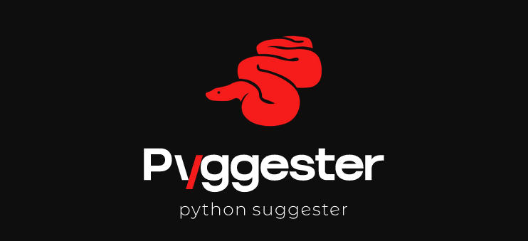

<!-- # nettxio_cli -->
<!-- <p align="center"> -->
  <!--  -->
<!-- </p> -->

<p align="center">
    
</p>

<h1 align="center">Pyggester - static/dynamic python analysis</h1>


# About

pyggester - (python + suggester) functions as both a static and dynamic analyzer. Its primary purpose lies in offering suggestions to enhance the efficiency of Python code by addressing suboptimal usage of data structures.

# Features

  The pyggester CLI presents two distinct features:
  - Static Analysis: This feature comprehensively examines your code without executing it, providing insightful insights into its structure and potential improvements.
    
    `Execution command`
    ``` bash
    pyggest static
    ```
    `output`
    ```bash
        Usage: pyggest static [OPTIONS]

    This function represents the 'static' subcommand of pyggest
    Perform static analysis using PyggestStatic.
    This command allows you to perform static analysis using PyggestStatic, a tool for analyzing Python code.
    You can specify various options to customize the analysis.

    ╭─ Options ──────────────────────────────────────────────────────────────────────────────────────────────────╮
    │ --path          TEXT  Database connection string [default: None]                                           │
    │ --lists               Use this option to include lists in analysis                                         │
    │ --dicts               Use this option to include dicts in analysis                                         │
    │ --sets                Use this option to include sets in analysis                                          │
    │ --tuples              Use this option to include tuples in analysis                                        │
    │ --all                 If you want pyggester to use all its capabilites use this option                     │
    │ --HELP                Get full documentation                                                               │
    │ --help                Show this message and exit.                                                          │
    ╰────────────────────────────────────────────────────────────────────────────────────────────────────────────╯
    ```

  - Dynamic Analysis: While currently not supported as a functional feature, it exists as a designated subcommand, hinting at future capabilities for dynamic code examination.

    `Execution command`

    > [!NOTE]
    > The 'dynamic' subcommand is currently not implemented

    ``` bash
    pyggest dynamic
    ```

    > [!IMPORTANT]
    >  ```bash 
    >  pyggest static/dynamic -- HELP offers built-in documentation for detailed usage
    >  ```


# Available Analyzers

The core functionality of pyggester revolves around analyzers, particularly node visitors that recursively ensure the examination of essential nodes to identify suboptimal usage of data structures. These analyzers attempt to suggest alternative data structures if any issues are detected.

Currently, the supported analyzer is:

  - TupleInsteadOfListAnalyzer

# Installation

### Using Pip
You can easily install the Python library using pip. Open your terminal and run the following command:
```bash
pip install pyggester

```


### Cloning the GitHub Repository

1. **Clone the Repository:** Open your terminal and run the following command to clone the GitHub repository to your local machine:

    ```bash
    git clone git@github.com:ValdonVitija/pyggester.git
    ```
2. **Navigate to the Repository:** Change your working directory to the cloned repository:

    ```bash
    cd pyggester
    ```
3. **Install pyggester as a pacakge locally:** 
    > [!IMPORTANT]
    > Consider doing this within a virtual environment (venv) if possible.

    ```bash
    pip install .
    ```


# Directory Structure
```bash
.
├── LICENSE
├── README.md #main readme file. The one you are currently reading.
├── VERSION #version of pyggester
├── data  #code files for the purpose of testing the overall execution of pyggester while developing the code
│   ├── __init__.py 
│   └── code.py #example file
├── pyggester # directory containing the full source code of pyggester
│   ├── __init__.py
│   ├── analyzer_iterator_mapping.py #creates a mapping model for analyzers and message iterators(one to one relationship)
│   ├── analyzers.py #contains the analyzer template and all the analyzers
│   ├── cli.py #defines the typer cli structure(command & options)
│   ├── command_handlers.py #Handles subcommands and every option variation per subcommand.
│   ├── data #data/config files related to pyggester. 
│   │   └── help_files #build in help files for the pyggester cli
│   │       ├── __init__.py 
│   │       ├── dynamic_helper.md #detailed built-in documentation for the dynamic subcommand of pyggest
│   │       └── static_helper.md #detailed built-in documentation for the static subcommand of pyggest
│   ├── helpers.py #helper functions to be used by other modules
│   ├── main.py #the entry point of pyggest execution. Initializes the typer cli app and prints the ascii logo of pyggester
│   ├── message_iterators.py #contains the message iterator template for analyzers and all message iterators
│   ├── pyggester.py #I like to call this module the engine of this tool because it glues all the different parts together.
│   ├── syntax_coloring.py #not defined yet
│   └── text_formatters.py #text formatters mainly for typer. How typer messages get streamed to the standard console
├── pyggester_logo.png
├── pytest.ini #config file for pytest
├── requirements.txt #every pyggester dependecy resides here
├── setup.py #creates the pyggester pacakge and defines pyggest as the entry point command to execute pyggester
└── tests 
    └── __init__.py
```
# Abstract Execution Flow

The following flow diagram illustrates key components of Pyggester and provides a comprehensive overview of the execution sequence.


# Contribution

To contribute to this project, please refer to the comprehensive  [contribution guide](contributing.md)  for detailed instructions and best practices.

# License

MIT License

Copyright (c) 2023 ValdonVitijaa

Permission is hereby granted, free of charge, to any person obtaining a copy
of this software and associated documentation files (the "Software"), to deal
in the Software without restriction, including without limitation the rights
to use, copy, modify, merge, publish, distribute, sublicense, and/or sell
copies of the Software, and to permit persons to whom the Software is
furnished to do so, subject to the following conditions:

The above copyright notice and this permission notice shall be included in all
copies or substantial portions of the Software.

THE SOFTWARE IS PROVIDED "AS IS", WITHOUT WARRANTY OF ANY KIND, EXPRESS OR
IMPLIED, INCLUDING BUT NOT LIMITED TO THE WARRANTIES OF MERCHANTABILITY,
FITNESS FOR A PARTICULAR PURPOSE AND NONINFRINGEMENT. IN NO EVENT SHALL THE
AUTHORS OR COPYRIGHT HOLDERS BE LIABLE FOR ANY CLAIM, DAMAGES OR OTHER
LIABILITY, WHETHER IN AN ACTION OF CONTRACT, TORT OR OTHERWISE, ARISING FROM,
OUT OF OR IN CONNECTION WITH THE SOFTWARE OR THE USE OR OTHER DEALINGS IN THE
SOFTWARE.


